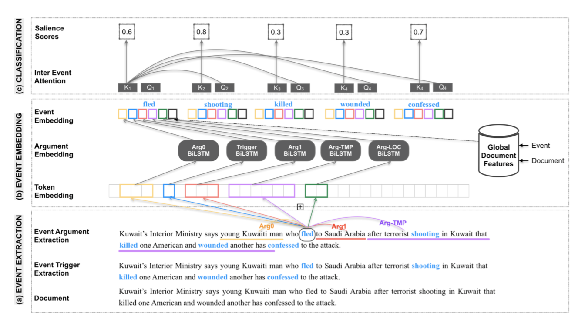

# Salient-Event-Detection
The repository for the paper "Is Killed More Significant than Fled? A Contextual Model for Salient Event Detection"

## Abstract

Identifying the key events in a document is critical to holistically understanding its important information. Although measuring the salience of events is highly contextual, most previous work has used a limited representation of events that omits essential information. In this work, we propose a highly contextual model of event salience that uses a rich representation of events, incorporates document-level information and allows for interactions between latent event encod- ings. Our experimental results on an event salience dataset (Liu et al., 2018) demonstrate that our model improves over previous work by an absolute 2-4% on standard metrics, establishing a new state-of-the-art performance for the task. We also propose a new evaluation metric which addresses flaws in previous evaluation methodologies. Finally, we discuss the importance of salient event detection for the downstream task of summarization.

## Data
The raw dataset used in this work is [Annotated NYT](https://catalog.ldc.upenn.edu/LDC2008T19). This dataset is distributed by LDC and due to the licence restrictions, we can not release the raw data. 

We process this dataset, perform initial filtering (filter the documents with missing fields or If there are no salient events) and extract features and labels. [Here](https://github.com/DishaJindal/Salient-Event-Detection/tree/master/data) is the train/test split of the final set of documents. Following are the links to the processed datasets. Fill in the *bodyText* and *abstract* fields (left empty) after obtaining the raw dataset from LDC.

[Training set](TODO)

[Test set](TODO)

### Setup

- Create a conda environment.

``conda create -n sed_env python=3.6``

- Activate the environment.

`` conda activate sed_env``

- Install dependencies using [this](https://github.com/DishaJindal/Salient-Event-Detection/blob/master/requirements.txt) file, it will take around ~ 4G.

``pip install -r requirements.txt``

## Training

1. Clone the code [repository](https://github.com/DishaJindal/Salient-Event-Detection).
1. Pass data path flags: `` train_data_path,  val_data_path, test_data_path `` with the appropriate locations while training.
1. Train using `` python CEE-train.py `` by passing desired flags. Here is a sample invocation:

  `` python CEE-train.py "BERT-SVA" model_name "0,1" -sl -nem -ps -frame ``

## Inference

1. Clone the code [repository](https://github.com/DishaJindal/Salient-Event-Detection).
1. Pass data path flags: `` test_dir and test_file `` with the test file path and name respectively along with the feature flags same as that of trained model.
1. Run inference using `` python CEE-predict.py `` by passing desired flags. Here is a sample invocation:

  `` python CEE-predict.py "BERT-SVA" "0,1" path_to_the_saved_model output_filename -ps -frame -sl -nem -an -af -event_only_trigger --test_dir test_file_dir_path --test_file test_filename``
  
Replace ``path_to_the_saved_model``, ``output_filename``, ``test_file_dir_path`` and ``test_filename`` appropriately.

To get Precision and Recall as per the new methodology, run:
  
  ``python eval/calculate_unique_pr.py -inp output_filename_from_above_step -out new_output_filename -input_doc_dir folder_name``

## Results

This [folder](https://github.com/DishaJindal/Salient-Event-Detection/tree/master/results) contains the document wise predictions of all models on the test set. 
The predictions of Location, Frequncy and KCM baselines can be found in the [baselines](https://github.com/DishaJindal/Salient-Event-Detection/tree/master/results/baselines) folder and 
of feature ablation models in the [ablations](https://github.com/DishaJindal/Salient-Event-Detection/tree/master/results/ablations) folder.

[cee_iee.json.zip](https://github.com/DishaJindal/Salient-Event-Detection/tree/master/results/cee_iee.json.zip) contains the predictions of the model with the best performance.

